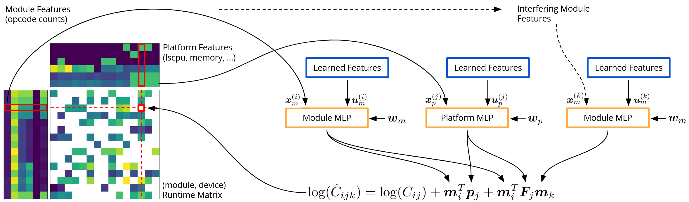

# Pitot: Bytecode Runtime Prediction by Matrix Factorization



Code and data for Pitot: Bytecode Runtime Prediction by Matrix Factorization.

***

Please note that our code base is optimized for cross-validation and replicate batching on relatively small datasets, and will be highly inefficient for one-off training or significantly larger datasets. In particular, we trade off memory usage and complexity (both time/space) for higher GPU utilization and overall better performance, but only when training hundreds of replicates simultaneously on datasets of similar size to ours. Training with a small number of replicates suffers from high overhead and low GPU utilization, while training on significantly larger datasets will suffer from memory exhaustion and disproportionately higher compute usage.

## Setup

Our experiments were run on Python 3.10, though any Python version supporting type checking by beartype and jaxtyping (3.7+) should work.

**NOTE**: assuming you want to use a GPU, you will need to [install JAX](https://github.com/google/jax#installation) with a version that matches your CUDA and CuDNN version.

```sh
pip install -r requirements.txt
```

**Anonymous OSF Repository**: download and extract the `pitot.zip` repository folder. Then, download `data.zip`, and extract into the repository code folder `pitot/`. If you wish to use our experiment metadata instead of rerunning from scratch, also download and extract `results.zip` into `pitot/`.

**NOTE**: `embedding/128/0.9.npz`, the only checkpoint required to draw our figures, is the only checkpoint included in `results.zip` due to the size of checkpoint files.

## Experiments

All of our experiments and figures are fully deterministic, and use the default random seed (42) provided.

To run our experiments used in the paper:
```sh
python manage.py experiments embedding/* features/* linear/128 baseline/*
python manage.py experiments interference/* -d data/data.if.npz
python manage.py experiments interference3/discard interference3/ignore interference3/2 -d data/data.if3.npz
python manage.py experiments interference3/no-smt -d data/data.if3.mc.npz
```

To draw the figures:
```sh
python manage.py compare
python manage.py figures
python manage.py tsne
python manage.py plot_simulation
```
